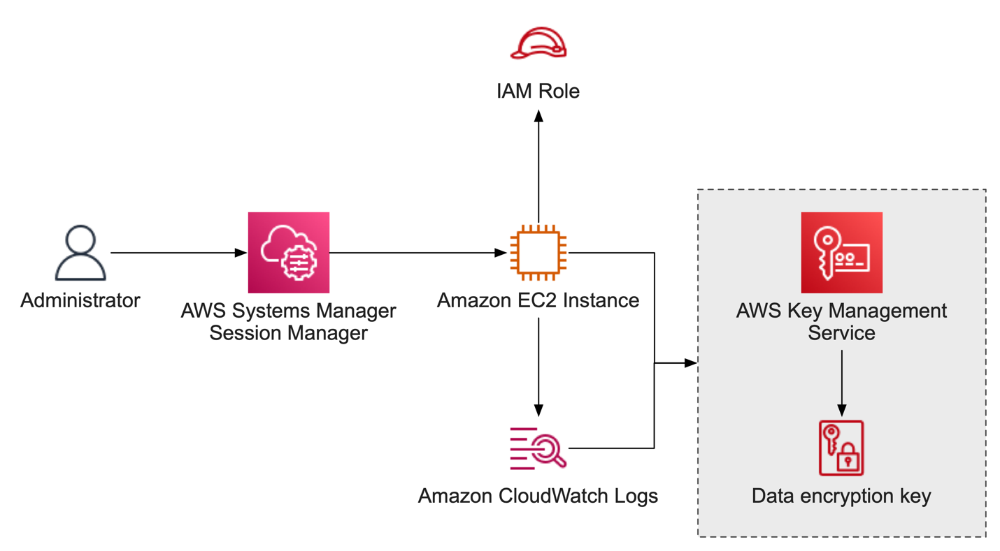

# AWS Services with Scripting and the AWS CLI

You can interact with AWS services through the AWS CLI or through clients that Amazon provides for several languages.

Less complex task - use the AWS CLI
More complex task - use the SDK

## Use Case - Removing Data from S3
You can use the AWS CLI to remove data like:

`aws s3 rm --recursive s3://my-bucket-name/my-prefix`

Kicking off multiple instances of this command for as many prefixes as you need via a bash script will allow lots of deletes.
You can get an equivalent script in Python using the Boto3 SDK and the batch delete operations, then kicking off several instances
of the script. However Python will give you the ability to filter or do something else with the data before you delete it.

## AWS Systems Manager - Session manager

- Allows you to manage your nodes from a CLI interface without worrying about open inbound
  ports, ssh keys, etc.
- Can Connect to both Amazon EC2 instances and non-EC2 managed nodes.

IAM is between the admin and AWS Systems Manager Session Manager.

## Stopinator

This is a script which I believe is placed on all EC2 Tasks/instances.

This is available in the session-manager CLI. You can add the tag:
`{'stopinator': 'stop'}` or `{'stopinator': 'terminate'}` and all of the instances with
that tage will be stoped.
