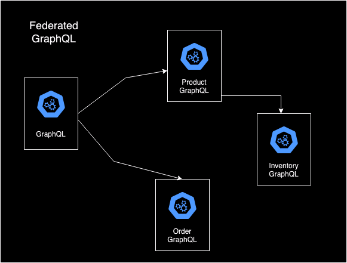

# GraphQL Schema with Federation
[BWP 304: Fast evolving GraphQL schema with federation.](https://www.youtube.com/watch?v=fmpQsbKMQ7E)

## Introduction
GraphQL uses the [federation pattern](https://graphql.com/learn/federated-architecture/) for application building. You have across your
system many services, each with their own function and focus. They all combine to make up the entire application. Each service has its
GraphQL schema. The federation architecture comes together when you combine all these schemas into a single GraphQL API.

## Schema Change problem

```graphql
type Product {
   title: String
   price: Price
   createDate: Int
	lastUpdateDate: int
}

```

Adding fields is backwards compatabile:
```graphql
type Product {
   title: String
   price: Price
   createDate: Int
   lastUpdateDate: int
   type: String
}
```

Removing fields would be not backward compatible. Changing type also is difficult.

GraphQL has a strong opinion on not doing versioning. It provides alternative approaches:

If you have a small amount of clients with small number of changes you can just evolve the schema.

If you don't you can create new schemas and and endpoints. (once a year once every two years ).

For a more changing API you can do a Schema Projection.

## Base schema -> Projected Schema

Example:

```graphql
type Product {
   title: String
   price: Price
   createDate: Int
   @Source(
     field: 'createdDate'
   )
   lastUpdateDate: int
   type: String
   @Added(fromVersion:"2")
   lastUpdatedDate: String
   @Removed(fromVersion:"3")
}
```

Projection Config
```
# Find an example of the projection Config to put here.
```

### Data Fetcher
Used to figure out what data it should return using the projection config.

## GraphQL federation



```graphql
extend type Product {
   inventory: Inventory
}

type Inventory {

}
```

Basically the system they've built gives them a way to detect breaking changes at build time to avoid making them unless you are doing it on purpose. You first release a draft build, have people test it then move it to a released state.

## Testing
You can add `@` annotations to enforce regex patterns or value requirements on a GraphQL schema.
