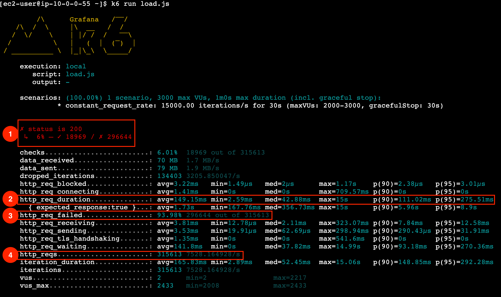
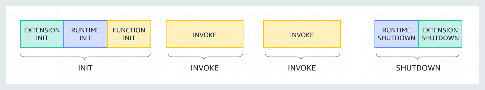

# AWS Scaling with Lambda

Lambda Concurrency

- Each Lambda is executed with its own execution. The warm environments are re-used as
  long as their are requrests available.
  - How do the requests get queued up if they envs are reused?

Concurrency = Invocations (in RPS) x Duration (in ms)

Long running functions require more concurrency. Concurrency is not infinite, there are
burst and account limits on concurrency.

You can optimize:

- for the duration of the Lambda
- the memory used by the Lambda

## K6 - Load testing

[Github for K6](https://github.com/grafana/k6)

1. Quick overview: This will display statistics about successful and failed requests.
   Here, 6% of the requests we sent received a successful response (HTTP 200)
1. Statistics about the request duration in milliseconds (ms). Overall, our requests had
   an average latency of 149.15ms
1. The amount of failed requests.
1. The total amount of requests and RPS.

Check the `k6` folder for the dockerfile and test code for the test scripts along with a
Readme describing how to use k6 for load testing.

## Optimizing a Lambda

[AWS Documentation on the subject](https://aws.amazon.com/blogs/compute/operating-lambda-performance-optimization-part-1/)

The basic parts of a Lambda execution are shown below. We can optimize each part of the
function in different ways as outlined below.

**Hint 1**: Lambda configuration allows us to select the memory allocated to our
functions, from a range between 128MB and 10GBs. Based on the amount of memory selected,
CPU and network throughput are allocated proportionally. Nonetheless, the INIT phase of
Lambda (the code which is executed outside of the handler) runs during a cold start when a
new execution environment needs to be created. During this initialization phase, the
function has access to the maximum CPU power available to Lambda functions, regardless of
the memory configured for the function. However, the memory allocation remains as
configured. This full CPU utilization during initialization allows for faster setup, but
it does not mean the function uses more memory than allocated. Once the initialization is
complete, the handler execution proceeds with the CPU power corresponding to the
function's configured memory setting. Additionally, initialization phase is not included
in the billed duration (unless it takes longer than expected and Lambda service must
perform a retry). This makes it advantageous to move any reusable code outside the
handler. So, what types of code could be shifted outside the handler for reuse across
invocations?

**Hint 2**: Lambda functions are stateless and should ideally be designed to support
idempotency. This is crucial in cases where the function, or parts of its code, may be
executed more than once, such as when an error triggers a retry. By incorporating
idempotency, we can prevent unnecessary repetition of write operations, ultimately
improving efficiency and reducing execution time.

Lambda Scaling tool -
[GitHub - alexcasalboni/aws-lambda-power-tuning: AWS Lambda Power Tuning is an open-source tool that can help you visualize and fine-tune the memory/power configuration of Lambda functions. It runs in your own AWS account - powered by AWS Step Functions - and it supports three optimization strategies: cost, speed, and balanced.](https://github.com/alexcasalboni/aws-lambda-power-tuning)

## Batch

Info By default, Lambda polls up to 10 messages in your queue at once and sends that batch
to your function. To avoid invoking the function with a small number of records, you can
let the event source buffer records for up to 5 minutes by configuring a batch window.
Before invoking the function, Lambda continues to poll messages from the standard queue
until the batch window expires, or the invocation payload size quota, or the configured
maximum batch size is reached. If you're using a batch window and your SQS queue contains
very low traffic, Lambda might wait for up to 20 seconds before invoking your function.
This is true even if you set a batch window lower than 20 seconds.

The Lambda function will now be triggered by a batch of up to 25 messages from the SQS
queue. The Lambda function will also write a batch of up to 25 messages to DynamoDB in one
call. This will not reduce the Write Capacity Units (WCU) of the DynamoDB table, but it
will reduce the number of write operations and increase the overall efficiency of the
architecture and the throughput of the system.

Pitfall to Avoid: Batch Size and Window in SQS with Lambda When configuring SQS as an
event source for Lambda with batched invocation, it’s tempting to increase the batch size
or window for greater efficiency, however, larger sizes do not always result in improved
performance. Larger batches can introduce delays in processing, as Lambda waits to
accumulate the full batch before invoking. This does not necessarily lead to more
efficiency. It can even complicate error handling. If a single message in a large batch is
corrupt, the entire batch might trigger a retry or a move to the Dead Letter Queue (DLQ),
which increases complexity. While partial batch response handling can mitigate this by
reprocessing only the failed messages, diagnosing and resolving issues within larger
batches still demands more careful attention. Always balance batch size and batch window
with the need for timely and reliable message processing.
