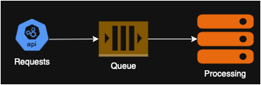

# Serverless Best Practices

This document describes some best practices when thinking through how to structure your serverless application. It was
based off [this site originally](https://www.infoq.com/articles/functionless-serverless-mindset/) but has been expanded
upon.

In general when building a serverless architecture you are looking to replace functional code with services. For example
you might use AWS Lambda to process API requests to remove the need to build code to manage a server. You will still
need to define the infrastructure code but you won't need to solve the problems of running the code behind the service.

## Using services incorrectly while handling data

Your serverless functions should not be used to solely move data from one service to another. If you are you are
probably not utilizing something available within the source service correctly.

#### : API Gateway and Dynamodb

Many operations can be done via API Gateway directly without the need of putting a compute like Lambda in between them.

Here is some AWS documentation on how to build a [basic REST API](https://serverlessland.com/patterns/apigw-dynamodb)
with Dynamodb as the backend.

*Storing an API request payload in a data payload* If you are purely taking a request from somewhere through API gateway
and saving it to dynamodb you can actually persist records through API gateway directly.
[See this repo for more information](https://github.com/rgyani/aws-api-gateway-direct-integration-dynamodb)

*Atomic data counter operations*
[General counter information for DynamoDB](https://aws.amazon.com/blogs/database/implement-resource-counters-with-amazon-dynamodb/)

*Buffering High-Volume API requests* You can use a pattern like below to Buffer requests for processing later.

